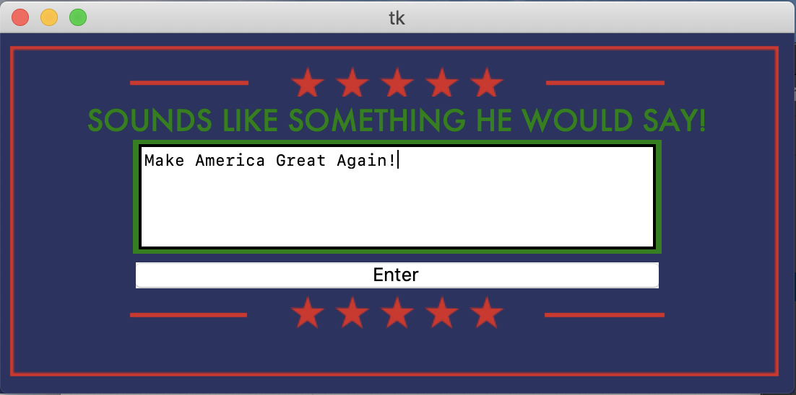
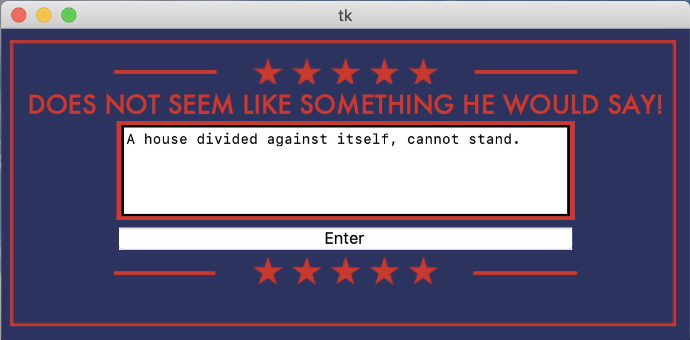
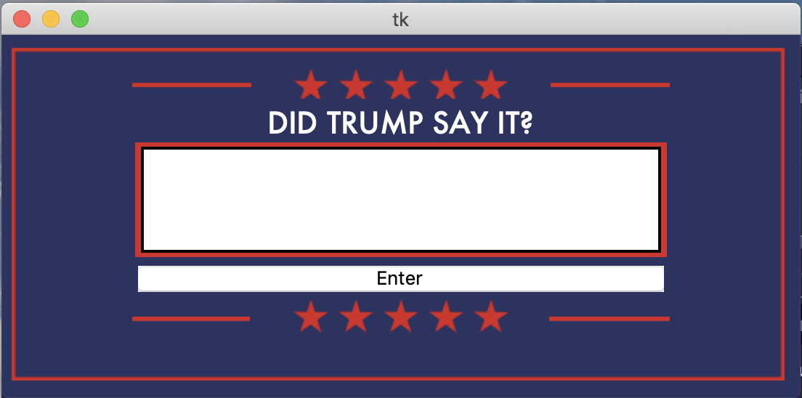

# Did Trump Say? (Twitter Machine learning)
A python program the trains a machine learning text classification model that predicts if a quote is attributed to the 45th president of the united states.

Check out Making_the_Model.ipynb to see how I trained the model.

Did_Trump_Say_Tk_GUI.py will run a fun GUI predict:
Screanshots:

