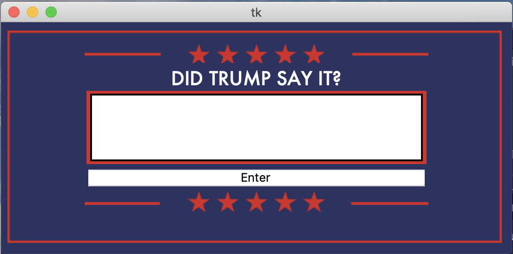
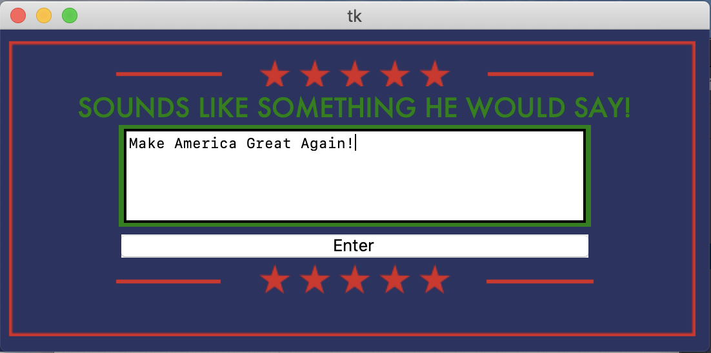
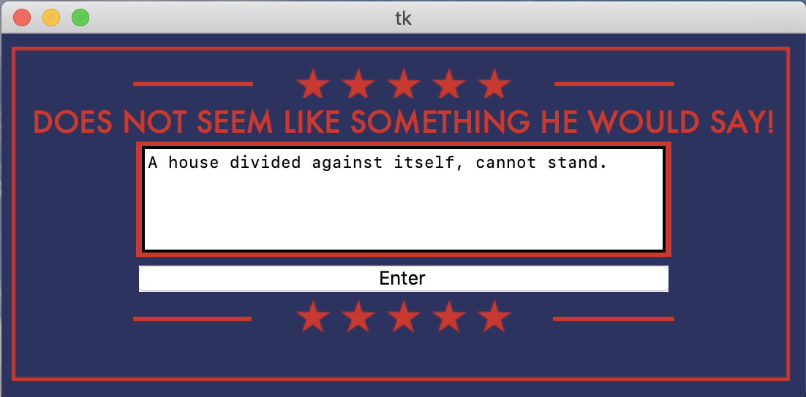

# Did Trump Say?

A python program that trains a machine learning text classification model and another python program that uses that trained model to predict if a quote is attributed to the 45th president of the United States.

## How the Model Was Trained

To see how the model was trained, check out the Making_the_Model.ipynb file. (Spoiler: I used Trump's tweets, he tweets a lot!)

## Using the GUI

To run the fun GUI that will predict if Trump said something, use the Did_Trump_Say_Tk_GUI.py file.

## Here are some screenshots of the GUI in action:

